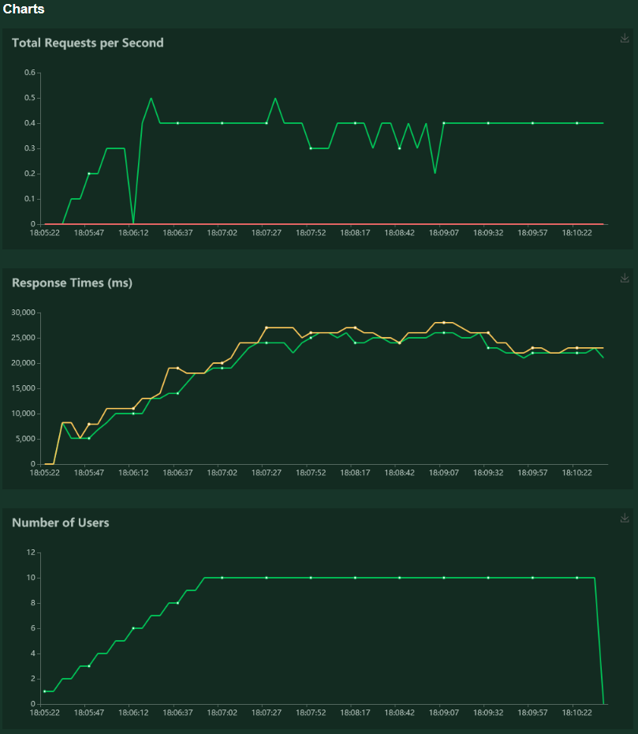
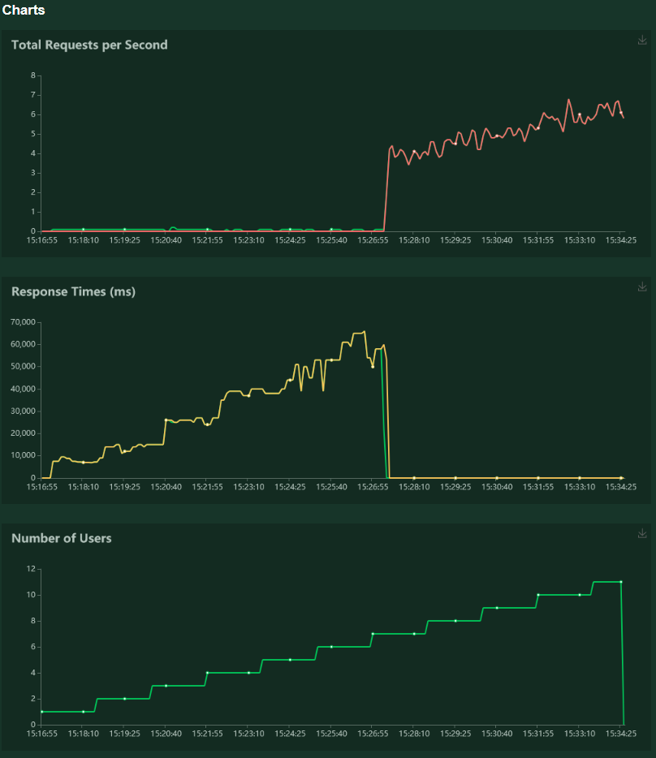

# Software engineering for AI project : Intent classification

Authors: [Chataigner Johan](https://github.com/JohanChataigne), [Germon Paul](https://github.com/pgermon), and [Martin Hugo](https://github.com/ScarfZapdos).

This project is based on its minimal version which can be found [here](https://hub.docker.com/r/wiidiiremi/projet_industrialisation_ia_3a).

The application offers to the users a classification model that takes their demands (french sentences) as input and classifies them into intents.

## Install and run the project

0. Install the requirements needed: `pip install -r requirements.txt`
1. Commands to run the application locally: 
   - `export FLASK_APP=app/app.py`
   - `python3 -m flask run` (debug server)
   - `python3 app/app.py` (production server with waitress)

2. Deploy application in a docker image:  
   - `docker build -t <img_name> <directory>`
   - `docker run -p 8080:8080 <img_name>`
    
3. Get the docker image on DockerHub and run it:
   - `docker pull ...`
   - `docker run -p 8080:8080 ...`

## Content of the project

### Repository tree organization

The repository is composed of the following files and folders:

📦projet_industrialisation_ia  
 ┣ 📂app : contains the files to run the application  
 ┣ 📂datas : contains the json datasets used to train the model  
 ┣ 📂models : contains the model saved  
 ┣ 📂notebooks  
 ┃ ┣ 📜model_v1.ipynb : notebook that trains the model  
 ┃ ┗ 📜project_analysis.ipynb : notebook in which we analyze the datasets and model provided  
 ┣ 📂obsolete_notebooks  
 ┣ 📂preprocessed_data : used to contain files storing the preprocessed data  
 ┣ 📂preprocessing  
 ┃ ┣ 📜dataset_balancing.py : contains functions used to balance the dataset   
 ┃ ┗ 📜preprocessing.py : contains functions used to preprocessed the dataset  
 ┣ 📂test : contains unit tests files  
 ┣ 📂test-img : contains locust test images for README  
 ┣ 📂threshold :  
   ┣ 📜threshold.py : contains functions used to compute the best threshold to be applied for our application    
 ┃ ┗ 📜best_threshold : store the value of the best   threshold computed  
 ┣ 📜Dockerfile  
 ┣ 📜README.md  
 ┗ 📜requirements.txt  

### Analysis and visualizations

The first step of the project is to analyze the minimal version provided to find out what it misses and what can be improved.  
In the notebook `project_analysis.ipynb` we make many visualizations and analysis on the given datasets and model in order to identify the most important metrics to be used to evaluate the performances of the model.  

### Data preprocessing

Seeing the analysis we have made on the datasets provided, we chose to balance the dataset in order to train our model. To do so we realised an oversampling of the less represented intents and an undersampling of the intent *irrelevant* in order to have 2000 samples of each intent. 

Then, in order to train our model as well as well as possible we had to preprocess the sentences of the dataset. We chose to use the SpaCy library to help us in this task. The preprocessing principally consists in:
- **removing special characters and determiners**: characters like emojis or punctuation signs and determiners like "a" are not that much usefull to identify the intent of a sentence. However we kept the accents which are widely used in French and the "€" symbol because it can help the model to identify the *purchase* intent for example.
- **vectorizing sentences**: we firstly used word vectors provided by SpaCy but the length of the sentences allowed was limited because the inputs of a model must always have the same shape. Therefore we chose to use sentence vectors which correspond to the mean of the vector of each word in the sentence.
- **one-hot encoding the intents**
  
We chose not to use the lemmatizer provided by SpaCy because we were receiving strange results for some words, maybe because the SpaCy french NLP model is less performant than the english one.

### Model training

After preprocessing the data, we tried to build a performant model in order to classify french sentences in a set of 8 different intents. Like the majority of text analysis Deep Learning models, our model is composed of a recurrent layer (Bidirectionnal LSTM) followed by several fully connected layers for classification. The output layer uses a *softmax* activation function in order to generate a set of probabilities matching the 8 intents. The model is trained using the *categorical crossentropy* loss function as the problem is a multi-class classification problem.

### Model evaluation

After training our model we had to evaluate its performance. We obtained the following performance metrics on testing set:

- Loss = 1.17
- Precision = 0.81
- Recall (weighted avg) = 0.81
- F1-score = 0.82
- F0.5-score = 0.83

In comparison, the base application performances were:

- Loss = 0.015
- Precision = 0.883
- Recall = 0.665
- F1-score = 0.758

We notice that our loss is way higher then the base model's one, and it's also the case compared to our training loss (0.05).
Looking at the other metrics, our model seems over all as performant as the previous one, maybe a little better.

Moreover, we can't really compare the two models based on this measures because they are not evaluated on the same datas. Indeed, the base model is evaluated on 10% of the training set and ours is evaluated on a separate testing set. This makes the base model look better than ours since it is evaluated on datas it has already seen.

So, as a conclusion for this part, we can't properly compare these 2 models based on evaluation measure since they don't comme from the same evaluation datas.

## Performance Tests
 It is important to know the performance of our service. In order to evaluate the REST API implemented previously, we chose to use Locust, which works well with Flask.
 We will make a given number of simultaneous calls to the API to test the average response time:
 

 
 As we can see, the service has some difficulties answering to a number of users greater than a dozen. Even with 15 users at a time, the API takes up to 3 minutes to anwser. After a moment, it crashes down. 
 It surely isn't ready to be put online according to these tests.
 
### Scaling

This test was made on a Intel Core i5-9600KF CPU at 3.70Ghz. To scale our system vertically, we could try to use the GPU in order to calculate faster the answers. In fact, the computer was having a hard time trying to handle even a pack of 5 users at a time. Scaling vertically is the most cost-efficient method to improve response time and stability. We could also use a higher amout of devices to run the API.

### Load ramp-up test

To load ramp-up test our API, we launch Locust with different parameters. The aim is to have an approximative maximum number of simultaneous users our service can handle.

To do so, we add a user every 100 seconds.

We can see with this test that 7 users at a time seems to be the limit. To improve precision, we made 10 other tests with similar parameters and ended with a mean of a maximum of 8 users at a time.

With this test, we can also see that the approximate response time is : 

`number_of_simultaneous_users * 10 seconds.`

## Future improvements
