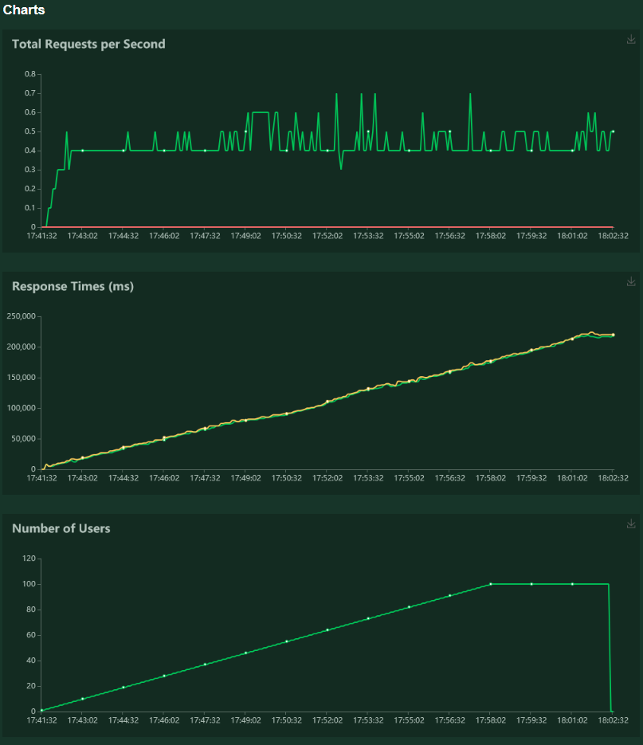

# Software engineering for AI project : Intent classification

Authors: [Chataigner Johan](https://github.com/JohanChataigne), [Germon Paul](https://github.com/pgermon), and [Martin Hugo](https://github.com/ScarfZapdos).

This project is based on its minimal version which can be found [here](https://hub.docker.com/r/wiidiiremi/projet_industrialisation_ia_3a).

The application offers to the users a classification model that takes their demands (french sentences) as input and classifies them into intents. You can find the built project image [here](https://hub.docker.com/r/idiwii/intent-classification-service/).

## Install and run the project

0. Install the requirements needed: `pip install -r requirements.txt`
1. Commands to run the application locally: 
   - `export FLASK_APP=app/app.py`
   - `python3 -m flask run` (debug server)
   - `python3 app/app.py` (production server with waitress)

2. Deploy application in a docker image:  
   - `docker build -t <img_name> <directory>`
   - `docker run -p 8080:8080 <img_name>`
    
3. ... or get the latest built image on DockerHub (995 MB) and run it:
   - `docker pull idiwii/intent-classification-service:latest`

## Content of the project

### Repository tree organization

The repository is composed of the following files and folders:

📦projet_industrialisation_ia  
 ┣ 📂app : contains the files to run the application  
 ┣ 📂datas : contains the json datasets used to train the model  
 ┣ 📂models : contains the model saved  
 ┣ 📂notebooks  
 ┃ ┣ 📜model_v1.ipynb : notebook that trains the model  
 ┃ ┗ 📜project_analysis.ipynb : notebook in which we analyze the datasets and model provided  
 ┣ 📂obsolete_notebooks  
 ┣ 📂preprocessed_data : used to contain files storing the preprocessed data  
 ┣ 📂preprocessing  
 ┃ ┣ 📜dataset_balancing.py : contains functions used to balance the dataset   
 ┃ ┗ 📜preprocessing.py : contains functions used to preprocessed the dataset  
 ┣ 📂test : contains unit tests files  
 ┣ 📂test-img : contains locust test images for README  
 ┣ 📂threshold :  
   ┣ 📜threshold.py : contains functions used to compute the best threshold to be applied for our application    
 ┃ ┗ 📜best_threshold : store the value of the best   threshold computed  
 ┣ 📜Dockerfile  
 ┣ 📜README.md  
 ┣ 📜requirements.txt  
 ┗ 📜benchmarking.txt : provides a quick comparative analysis between our model and the one that was given for several sentences

### Analysis and visualizations

The first step of the project is to analyze the minimal version provided to find out what it misses and what can be improved.  
In the notebook `project_analysis.ipynb` we make many visualizations and analysis on the given datasets and model in order to identify the most important metrics to be used to evaluate the performances of the model.  

### Data preprocessing

Seeing the analysis we have made on the datasets provided, we chose to balance the dataset in order to train our model. To do so we realised an oversampling of the less represented intents and an undersampling of the intent *irrelevant* in order to have 2000 samples of each intent. 

Then, in order to train our model as well as well as possible we had to preprocess the sentences of the dataset. We chose to use the SpaCy library to help us in this task. The preprocessing principally consists in:
- **removing special characters and determiners**: characters like emojis or punctuation signs and determiners like "a" are not that much usefull to identify the intent of a sentence. However we kept the accents which are widely used in French and the "€" symbol because it can help the model to identify the *purchase* intent for example.
- **vectorizing sentences**: we firstly used word vectors provided by SpaCy but the length of the sentences allowed was limited because the inputs of a model must always have the same shape. Therefore we chose to use sentence vectors which correspond to the mean of the vector of each word in the sentence.
- **one-hot encoding the intents**
  
We chose not to use the lemmatizer provided by SpaCy because we were receiving strange results for some words, maybe because the SpaCy french NLP model is less performant than the english one.

### Model training

After preprocessing the data, we tried to build a performant model in order to classify french sentences in a set of 8 different intents. Like the majority of text analysis Deep Learning models, our model is composed of a recurrent layer (Bidirectionnal LSTM) followed by several fully connected layers for classification. We also tried the same architecture replacing the LSTM by a GRU but we got similar results so we just kept the LSTM layer. The output layer uses a *softmax* activation function in order to generate a set of probabilities matching the 8 intents. The model is trained using the *categorical crossentropy* loss function as the problem is a multi-class classification problem.

### Model evaluation

After training our model we had to evaluate its performance. We obtained the following performance metrics on testing set:

- Loss = 1.17
- Precision = 0.81
- Recall (weighted avg) = 0.81
- F1-score = 0.82
- F0.5-score = 0.83

In comparison, the base application performances were:

- Loss = 0.015
- Precision = 0.883
- Recall = 0.665
- F1-score = 0.758

We notice that our loss is way higher than the base model's one, and it's also the case compared to our training loss (0.05).
Looking at the other metrics, our model seems over all as performant as the previous one, maybe a little better.

Moreover, we can't really compare the two models based on this measures because they are not evaluated on the same datas. Indeed, the base model is evaluated on 10% of the training set and ours is evaluated on a separate testing set. This makes the base model look better than ours since it is evaluated on datas it has already seen.

So, as a conclusion for this part, we can't properly compare these 2 models based on evaluation measure since they don't come from the same evaluation datas.  
However, the file `benchmarking.txt` provides a quick comparison of the two models for some example sentences and we can see that our model does not make any mistake on these examples and seems quite reliable.

## Performance Tests
 It is important to know the performance of our service. In order to evaluate the REST API implemented previously, we chose to use Locust, which works well with Flask.
 We will make a given number of simultaneous calls to the API to test the average response time:
 

 
 As we can see, the service responds quicker if there are a low number of simultaneous users. It surely isn't ready to be put online according to these tests, as the answering time is too long to be used by clients. Waiting for more than 20 seconds for an anwser is unthinkable. 
 
With this test, we can also see that the approximate response time is `number_of_simultaneous_users * 2.5 seconds` when there are about 10 users at the same time.

### Scaling

This test was made on a Intel Core i5-9600KF CPU at 3.70Ghz. To scale our system vertically, we could try to use the GPU in order to calculate faster the answers. In fact, the computer was having a hard time trying to handle even a pack of 5 users at a time. Scaling vertically is the most cost-efficient method to improve response time and stability. We could also use a higher amount of devices to run the API.

### Load ramp-up test

To load ramp-up test our API, we launched Locust with different parameters. The aim is to have an approximative maximum number of simultaneous users our service can handle.

To do so, we add a user every 10 seconds up to 100 users.

We can see with this test that as long as users don't use the API too quickly, the service holds up. To improve precision, we made 10 other tests with different parameters and ended with a required time of 0.5 second between each call or the service crashes quickly.

## Future improvements

### Data improvements

Speaking about datas, we thought about the following improvements:
- Try other over/under-sampling strategies than the random one we used (for example SMOTE and ADASYN).
- Create synthetic data instead of oversampling (maybe hard with text).

### Peprocessing improvements

We can think of a lot of different things we could have done in the preprocessing steps, here are some of them:
- Use word vectors to keep more information on sense and restrict the sentence length that the user can give (and use padding).
- Train and tune an embedding model to get our own computation of word vectors.
- Use more the tagger to remove more than just the determiners (for example pronouns).
- Try to find a good lemmatizer on french language to integrate in the preprocessing pipeline.

### Model improvements

- Train a deeper model with more fully connected layers and a larger RNN layer.
- Evaluate the model with other metrics (for example Fbeta score with other betas than 0.5 but still inferior to 1).

### Application improvements

The application improvements mainly concerns speed, documentation and UI.
To improve those things we could:
- Try another framework than Flask such as Django.
- Study more Swagger documentation for the UI or use another tool.
- Move to an ASGI server, because the service should be able to receive multiple requests from one user an switch between them when he gets an answer from the server. This can be done with an asynchronous implementation like ASGI.  